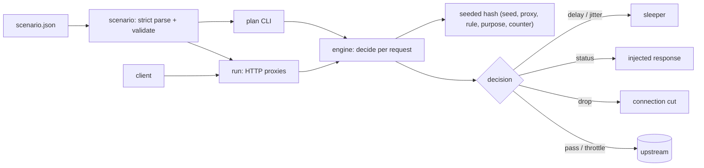

# slowlane

[English](README.md) | [中文](README.zh.md) | [日本語](README.ja.md)

[](LICENSE) [](go.mod) [](CHANGELOG.md)  [](CONTRIBUTING.md)

**slowlane：宣言的でシード付きのシナリオファイルから、スクリプト化されたレイテンシ・ジッター・切断・5xx を実行するオープンソースのフォールトインジェクションプロキシ — プランがそのままランタイム、コントロールプレーン SDK は不要。**


```bash
git clone https://github.com/JaydenCJ/slowlane && cd slowlane
go build -o slowlane ./cmd/slowlane    # single static binary, stdlib only
```

> プレリリース：v0.1.0 はまだどのパッケージレジストリにもタグ付けされていません。上記の手順でソースからビルドしてください（Go ≥1.22 なら何でも可）。

## なぜ slowlane？

レジリエンステストはいつも同じ形で失敗します：フォールトインジェクター自身がパイプラインで一番不安定な部品になるのです。定番の Toxiproxy は toxic がランタイム API の向こう側にあり、テストスイートにはクライアント SDK と setup/teardown の段取りが必要で、しかも注入内容はランダム抽選——CI で落ちたあの実行は、ローカルでは再現できません。Envoy の fault filter は宣言的ですがサービスメッシュ一式を引き連れ、そのパーセンテージ障害もやはり非決定的です。`tc netem` は root が必要で HTTP をまったく見られません。slowlane の立場はこうです：フォールトは *設定* であって API 呼び出しではない。誰がどこで待ち受け、どこへ転送し、どのリクエストにどの障害を注入するか——JSON シナリオを 1 つ書けば、すべての確率的選択はシナリオのシードとリクエストカウンタの純粋なハッシュになります。`slowlane plan` はポートを 1 つも束縛する前に正確な障害スケジュールを印字し、実際のプロキシはまったく同一の判断を下し、同じシードはあなたのノート PC でも CI でも来月でも同じ障害を再生します。

| | slowlane | Toxiproxy | Envoy fault filter | tc netem |
|---|---|---|---|---|
| 障害を 1 ファイルで宣言、ランタイム API 不要 | ✅ | ❌ クライアント SDK | ✅ ただしメッシュ設定 | ❌ root シェル |
| シード付き決定的障害、実行ごとに再生可能 | ✅ | ❌ ランダム | ❌ ランダム % | ❌ ランダム |
| 実行前に正確な障害スケジュールを印字 | ✅ `plan` | ❌ | ❌ | ❌ |
| HTTP を理解した障害（5xx 注入、ルート別マッチ） | ✅ | ❌ TCP レベル | ✅ | ❌ パケットのみ |
| リクエスト数フェーズで CI の各段階を再現 | ✅ | ❌ 実時間 | ❌ | ❌ |
| 単一の静的バイナリ | ✅ | ✅ | ❌ | カーネルモジュール |
| ランタイム依存 | 0 | 0（サーバ）+ 各言語 SDK | Envoy 一式 | iproute2 + root |

<sub>2026-07-12 確認：slowlane が import するのは Go 標準ライブラリのみ。Toxiproxy はテストから toxic を変更するのに各言語クライアントライブラリ（Go/Ruby/Python/Node/…）のいずれかが必要。</sub>

## 特長

- **シナリオファイル第一** — 厳格にパースされる 1 つの JSON ファイルがリスナー・アップストリーム・マッチャー・フェーズ・障害を定義。フィールドの typo は `slowlane check` が位置付きで報告し（`proxies[0].rules[2].rate`）、静かに発火しないままにはなりません。
- **ビット単位で仕様化されたシード決定性** — すべての rate・jitter 判断は (seed, proxy, rule, purpose, counter) の純粋な SplitMix64 ハッシュ。アルゴリズムはゴールデンテストで固定され、ファイル形式契約の一部として [docs/determinism.md](docs/determinism.md) に文書化。
- **実行前に `plan`** — ポートを束縛せずに任意のリクエスト形状のリクエスト別障害スケジュールを印字。実プロキシは同一の判断を計算するため、プランがそのまま CI の契約になります。
- **フルの障害パレット** — 固定遅延 + シードジッター、body 付きステータス注入、突然の切断、バイト毎秒のレスポンス帯域制限。明示的な法則で合成：遅延は累積、最初の終端が勝ち、最初のスロットルが勝つ。
- **実時間ではなくリクエスト数フェーズ** — `{"from": 11, "to": 30, "every": 2}` のようなウィンドウが障害をプロキシ別リクエストカウンタに結びつけ、「リクエスト 11–30 はブラウンアウト」がどんなマシン速度でも同一に再生されます。
- **自己記述的なレスポンス** — 注入障害は `X-Slowlane-Injected: <rule>`、遅延は `X-Slowlane-Delay` を持ち、全レスポンスが自分のカウンタを運ぶ。503 が slowlane 由来か本当に壊れたアップストリーム由来か、アサーションが推測する必要はありません。
- **依存ゼロ・ループバック限定** — Go 標準ライブラリのみ、テレメトリなし、例は 127.0.0.1 に束縛。内蔵の `echo` アップストリームにより、デモに必要なのはこのバイナリ 1 つだけ。

## クイックスタート

```bash
./slowlane echo --listen 127.0.0.1:18081 &         # a stand-in upstream
./slowlane plan --from 10 --requests 4 examples/flaky-upstream.json
./slowlane run examples/flaky-upstream.json        # proxy on :18080
```

`plan` は*これから*起きることを印字します（実際のキャプチャ出力）：

```text
plan: proxy "api" seed 42 — GET /, requests 10-13

  req  action
   10  pass
   11  503 (brownout)
   12  pass
   13  503 (brownout)

4 requests: 2 pass, 0 delayed (total 0ms), 2 injected, 0 dropped, 0 throttled
```

プロキシにリクエストを流すと、それが正確に起きます（実際の `run` ログ）：

```text
proxy api listening on 127.0.0.1:18080 -> http://127.0.0.1:18081
api #10 GET /users/10 [pass] -> 200
api #11 GET /users/11 [503 (brownout)] -> 503
```

注入されたレスポンスは、何が命中したかをクライアントに正確に伝えます（`curl -si`、実出力。実行ごとに変わる `Date` ヘッダのみ省略）：

```text
HTTP/1.1 503 Service Unavailable
Content-Length: 16
Content-Type: text/plain; charset=utf-8
X-Slowlane-Injected: brownout
X-Slowlane-Request: 11

injected outage
```

[`examples/ci-gate.sh`](examples/ci-gate.sh) はこのループをそのまま使えるパイプラインゲートに変えます。

## シナリオ形式

ルールはセレクタ群と 1 つの障害の組み合わせ。完全なリファレンスは [docs/scenario-format.md](docs/scenario-format.md) に。

| 障害キー | 型 | 効果 |
|---|---|---|
| `delay_ms` / `jitter_ms` | int | 固定遅延 + `[0, jitter_ms]` ms のシード付き追加遅延 |
| `status` + `body` | int, string | この HTTP レスポンスで短絡；アップストリームには触れない |
| `drop` | bool | レスポンスバイトを送る前にクライアント接続を切断 |
| `throttle_bps` | int | アップストリームレスポンスボディのコピー速度を制限 |

| セレクタ | 意味 |
|---|---|
| `match` | メソッド、セグメント glob パス（`/api/**`、`/users/*`）、ヘッダ完全一致 |
| `window` | リクエストカウンタのフェーズ：`from` / `to` / `every` |
| `rate` | 発火確率 0–1、シードから決定的に判定 |

## CLI リファレンス

`slowlane <run|check|plan|echo|version>` — 終了コード：0 成功、1 シナリオ不正 / チェック失敗、2 使用法エラー、3 ランタイムエラー。

| コマンド | 主なフラグ | 効果 |
|---|---|---|
| `run <scenario>` | `--log text\|json`、`--quiet` | 全プロキシを束縛し、障害を注入し、リクエストごとにログ |
| `check <scenario>` | `--format text\|json` | 厳格な検証；すべての指摘に位置付き |
| `plan <scenario>` | `--proxy`、`--from`、`--requests`、`--method`、`--path`、`--header`、`--format` | 正確な障害スケジュールを印字、ポート束縛なし |
| `echo` | `--listen` | ローカル試行用の内蔵決定的アップストリーム |

## 検証

このリポジトリは CI を一切同梱しません。上のすべての主張はローカル実行で検証されます：

```bash
go test ./...            # 89 deterministic tests, loopback only, < 5 s
bash scripts/smoke.sh    # end-to-end proxy check, prints SMOKE OK
```

## アーキテクチャ



## ロードマップ

- [x] v0.1.0 — 厳格検証付きシナリオ形式 v1、シード決定性エンジン、遅延/ジッター/5xx/切断/帯域制限の障害、`run`/`check`/`plan`/`echo` CLI、89 テスト + smoke スクリプト
- [ ] 生 TCP プロキシモード（非 HTTP プロトコル向けの切断と帯域制限）
- [ ] レスポンス途中の障害：body N バイト後に切断または停止
- [ ] `slowlane record`：観測トラフィックからシナリオの骨格を導出
- [ ] シナリオ合成（`include`）による共有障害ライブラリ
- [ ] シャットダウンサマリでのルール別レイテンシヒストグラム

完全なリストは [open issues](https://github.com/JaydenCJ/slowlane/issues) を参照。

## コントリビュート

Issue・ディスカッション・PR を歓迎します — ローカルワークフロー（format、vet、テスト、`SMOKE OK`）とシードハッシュ互換性ルールは [CONTRIBUTING.md](CONTRIBUTING.md) を参照。入門しやすいタスクは [good first issue](https://github.com/JaydenCJ/slowlane/issues?q=is%3Aissue+is%3Aopen+label%3A%22good+first+issue%22) のラベル付き、設計の議論は [Discussions](https://github.com/JaydenCJ/slowlane/discussions) で。

## ライセンス

[MIT](LICENSE)
