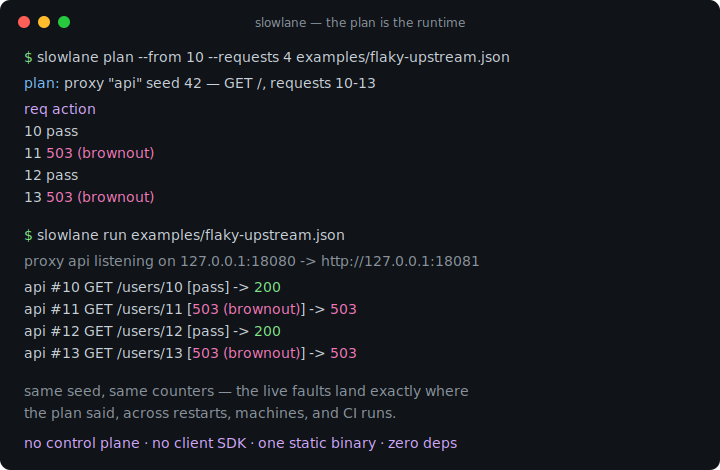
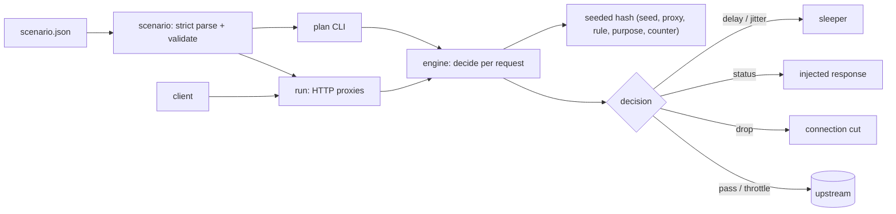

# slowlane

[English](README.md) | [中文](README.zh.md) | [日本語](README.ja.md)

[](LICENSE) [](go.mod) [](CHANGELOG.md)  [](CONTRIBUTING.md)

**slowlane：an open-source fault-injection proxy that runs scripted latency, jitter, drops, and 5xx from a declarative, seeded scenario file — the plan is the runtime, no control-plane SDK required.**



```bash
git clone https://github.com/JaydenCJ/slowlane && cd slowlane
go build -o slowlane ./cmd/slowlane    # single static binary, stdlib only
```

> Pre-release: v0.1.0 is not tagged on a package registry yet; build from source as above (any Go ≥1.22).

## Why slowlane?

Resilience testing keeps failing the same way: the fault injector itself becomes the flaky part of the pipeline. Toxiproxy is the standard answer, but its toxics live behind a runtime API — your test suite needs a client SDK, setup/teardown choreography, and whatever it injects is randomly drawn, so the run that failed CI is not the run you can reproduce locally. Envoy's fault filter is declarative but drags an entire service mesh along, and its percentage faults are nondeterministic too; `tc netem` needs root and cannot even see HTTP. slowlane's position: faults are *configuration*, not API calls. You write one JSON scenario — who listens where, forwarding to what, injecting which faults on which requests — and every probabilistic choice is a pure hash of the scenario seed and the request counter. `slowlane plan` prints the exact fault schedule before anything binds a port, the live proxy makes the identical decisions, and the same seed replays the same faults on your laptop, in CI, next month.

| | slowlane | Toxiproxy | Envoy fault filter | tc netem |
|---|---|---|---|---|
| Faults declared in one file, no runtime API | ✅ | ❌ client SDK | ✅ but mesh config | ❌ root shell |
| Deterministic seeded faults, replayable run-to-run | ✅ | ❌ random | ❌ random % | ❌ random |
| Print the exact fault schedule before running | ✅ `plan` | ❌ | ❌ | ❌ |
| HTTP-aware faults (5xx injection, per-route match) | ✅ | ❌ TCP-level | ✅ | ❌ packets |
| Request-count phases for reproducible CI stages | ✅ | ❌ wall-clock | ❌ | ❌ |
| Single static binary | ✅ | ✅ | ❌ | kernel module |
| Runtime dependencies | 0 | 0 (server) + SDK per language | full Envoy | iproute2 + root |

<sub>Checked 2026-07-12: slowlane imports the Go standard library only; Toxiproxy requires one of its per-language client libraries (Go/Ruby/Python/Node/…) to change toxics from tests.</sub>

## Features

- **Scenario-file-first** — one strict-parsed JSON file defines listeners, upstreams, matchers, phases, and faults. A typoed field fails `slowlane check` with its location (`proxies[0].rules[2].rate`) instead of silently never firing.
- **Seeded determinism, specified to the bit** — every rate and jitter decision is a pure SplitMix64 hash of (seed, proxy, rule, purpose, counter); the algorithm is pinned by golden tests and documented in [docs/determinism.md](docs/determinism.md) as part of the file format contract.
- **`plan` before you run** — print the per-request fault schedule for any request shape without binding a port; the live proxy computes the identical decisions, so the plan doubles as the CI contract.
- **The full fault palette** — fixed delay + seeded jitter, injected status with body, abrupt connection drops, and bytes-per-second response throttling, composed by explicit laws: delays accumulate, first terminal wins, first throttle wins.
- **Request-count phases, not wall-clock** — windows like `{"from": 11, "to": 30, "every": 2}` key faults to the per-proxy request counter, so "requests 11–30 brown out" replays identically at any machine speed.
- **Self-describing responses** — injected faults carry `X-Slowlane-Injected: <rule>`, delays carry `X-Slowlane-Delay`, every response carries its counter; assertions never guess whether a 503 was slowlane or a genuinely broken upstream.
- **Zero dependencies, loopback-honest** — Go standard library only, no telemetry, examples bind 127.0.0.1; a built-in `echo` upstream means the demo needs nothing but this binary.

## Quickstart

```bash
./slowlane echo --listen 127.0.0.1:18081 &         # a stand-in upstream
./slowlane plan --from 10 --requests 4 examples/flaky-upstream.json
./slowlane run examples/flaky-upstream.json        # proxy on :18080
```

`plan` prints what *will* happen (real captured output):

```text
plan: proxy "api" seed 42 — GET /, requests 10-13

  req  action
   10  pass
   11  503 (brownout)
   12  pass
   13  503 (brownout)

4 requests: 2 pass, 0 delayed (total 0ms), 2 injected, 0 dropped, 0 throttled
```

Drive requests through the proxy and it happens, exactly (real `run` log):

```text
proxy api listening on 127.0.0.1:18080 -> http://127.0.0.1:18081
api #10 GET /users/10 [pass] -> 200
api #11 GET /users/11 [503 (brownout)] -> 503
```

The injected response tells the client precisely what hit it (`curl -si`, real output; only the run-dependent `Date` header is elided):

```text
HTTP/1.1 503 Service Unavailable
Content-Length: 16
Content-Type: text/plain; charset=utf-8
X-Slowlane-Injected: brownout
X-Slowlane-Request: 11

injected outage
```

[`examples/ci-gate.sh`](examples/ci-gate.sh) turns this loop into a ready-made pipeline gate.

## Scenario format

Rules combine selectors with one fault; the full reference lives in [docs/scenario-format.md](docs/scenario-format.md).

| Fault key | Type | Effect |
|---|---|---|
| `delay_ms` / `jitter_ms` | int | fixed latency + seeded extra in `[0, jitter_ms]` ms |
| `status` + `body` | int, string | short-circuit with this HTTP response; upstream untouched |
| `drop` | bool | sever the client connection before any response bytes |
| `throttle_bps` | int | cap the upstream response body copy rate |

| Selector | Meaning |
|---|---|
| `match` | methods, segment-glob path (`/api/**`, `/users/*`), exact headers |
| `window` | request-counter phase: `from` / `to` / `every` |
| `rate` | fire probability 0–1, decided deterministically from the seed |

## CLI reference

`slowlane <run|check|plan|echo|version>` — exit codes: 0 ok, 1 invalid scenario / failed check, 2 usage error, 3 runtime error.

| Command | Key flags | Effect |
|---|---|---|
| `run <scenario>` | `--log text\|json`, `--quiet` | bind every proxy, inject faults, log each request |
| `check <scenario>` | `--format text\|json` | strict validation; every finding with its location |
| `plan <scenario>` | `--proxy`, `--from`, `--requests`, `--method`, `--path`, `--header`, `--format` | print the exact fault schedule, no ports bound |
| `echo` | `--listen` | built-in deterministic upstream for local trials |

## Verification

This repository ships no CI; every claim above is verified by local runs:

```bash
go test ./...            # 89 deterministic tests, loopback only, < 5 s
bash scripts/smoke.sh    # end-to-end proxy check, prints SMOKE OK
```

## Architecture



## Roadmap

- [x] v0.1.0 — scenario format v1 with strict validation, seeded deterministic engine, delay/jitter/5xx/drop/throttle faults, `run`/`check`/`plan`/`echo` CLI, 89 tests + smoke script
- [ ] Raw TCP proxy mode (drops and throttles for non-HTTP protocols)
- [ ] Mid-response faults: truncate or stall after N body bytes
- [ ] `slowlane record` to derive a scenario skeleton from observed traffic
- [ ] Scenario composition (`include`) for shared fault libraries
- [ ] Latency histograms per rule in the shutdown summary

See the [open issues](https://github.com/JaydenCJ/slowlane/issues) for the full list.

## Contributing

Issues, discussions and pull requests are welcome — see [CONTRIBUTING.md](CONTRIBUTING.md) for the local workflow (format, vet, tests, `SMOKE OK`) and the seeded-hash compatibility rule. Good entry points are labelled [good first issue](https://github.com/JaydenCJ/slowlane/issues?q=is%3Aissue+is%3Aopen+label%3A%22good+first+issue%22), and design questions live in [Discussions](https://github.com/JaydenCJ/slowlane/discussions).

## License

[MIT](LICENSE)
