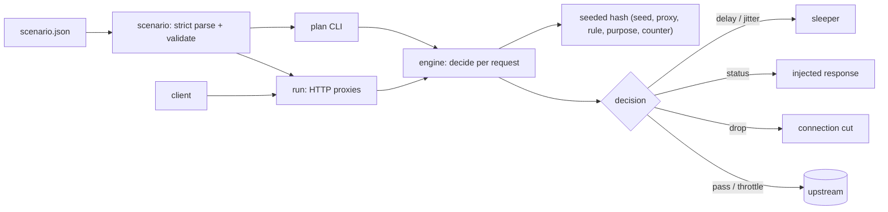

# slowlane

[English](README.md) | [中文](README.zh.md) | [日本語](README.ja.md)

[](LICENSE) [](go.mod) [](CHANGELOG.md)  [](CONTRIBUTING.md)

**slowlane：开源故障注入代理，按声明式、带种子的场景文件执行脚本化的延迟、抖动、断连和 5xx —— 计划即运行时，无需控制面 SDK。**


```bash
git clone https://github.com/JaydenCJ/slowlane && cd slowlane
go build -o slowlane ./cmd/slowlane    # single static binary, stdlib only
```

> 预发布：v0.1.0 尚未在任何包注册表上打 tag；请按上述方式从源码构建（任意 Go ≥1.22）。

## 为什么选 slowlane？

韧性测试总是以同一种方式失败：故障注入器自己成了流水线里最不稳定的一环。Toxiproxy 是标准答案，但它的 toxic 藏在运行时 API 背后——测试套件需要客户端 SDK、setup/teardown 编排，而它注入的内容是随机抽取的，CI 里失败的那次运行在本地根本无法复现。Envoy 的 fault filter 虽然是声明式的，却要拖上整套服务网格，其百分比故障同样不确定；`tc netem` 需要 root 权限且完全看不见 HTTP。slowlane 的立场是：故障是*配置*，不是 API 调用。你只写一个 JSON 场景——谁监听在哪、转发到哪、在哪些请求上注入哪些故障——所有概率性选择都是场景种子与请求计数器的纯哈希。`slowlane plan` 在绑定任何端口之前就打印出精确的故障时间表，实际代理做出完全相同的决策，同一个种子在你的笔记本、在 CI、在下个月都重放同样的故障。

| | slowlane | Toxiproxy | Envoy fault filter | tc netem |
|---|---|---|---|---|
| 故障在单个文件里声明，无运行时 API | ✅ | ❌ 需客户端 SDK | ✅ 但需网格配置 | ❌ root shell |
| 带种子的确定性故障，逐次运行可重放 | ✅ | ❌ 随机 | ❌ 随机百分比 | ❌ 随机 |
| 运行前打印精确故障时间表 | ✅ `plan` | ❌ | ❌ | ❌ |
| HTTP 感知故障（注入 5xx、按路由匹配） | ✅ | ❌ 仅 TCP 层 | ✅ | ❌ 仅数据包 |
| 请求计数阶段，CI 各阶段可复现 | ✅ | ❌ 墙钟时间 | ❌ | ❌ |
| 单个静态二进制 | ✅ | ✅ | ❌ | 内核模块 |
| 运行时依赖 | 0 | 0（服务端）+ 各语言 SDK | 完整 Envoy | iproute2 + root |

<sub>核对于 2026-07-12：slowlane 仅导入 Go 标准库；Toxiproxy 若要在测试中变更 toxic，需要其各语言客户端库之一（Go/Ruby/Python/Node/…）。</sub>

## 特性

- **场景文件优先** — 一个严格解析的 JSON 文件定义监听器、上游、匹配器、阶段与故障。字段拼错会让 `slowlane check` 带位置报错（`proxies[0].rules[2].rate`），而不是悄悄永不触发。
- **精确到比特的种子确定性** — 每个 rate 与 jitter 决策都是 (seed, proxy, rule, purpose, counter) 的纯 SplitMix64 哈希；算法由 golden 测试钉死，并作为文件格式契约的一部分记录在 [docs/determinism.md](docs/determinism.md)。
- **先 `plan` 再运行** — 不绑定端口即可打印任意请求形状的逐请求故障时间表；实际代理计算完全相同的决策，因此计划本身就是 CI 契约。
- **完整的故障面板** — 固定延迟 + 种子抖动、带 body 的注入状态码、突然断连、按字节每秒的响应限速，按显式法则组合：延迟累加、首个终结故障获胜、首个限速获胜。
- **请求计数阶段而非墙钟** — 形如 `{"from": 11, "to": 30, "every": 2}` 的窗口把故障锚定到每代理请求计数器，"第 11–30 个请求进入 brownout"在任何机器速度下都完全一致地重放。
- **自描述的响应** — 注入的故障带 `X-Slowlane-Injected: <rule>`，延迟带 `X-Slowlane-Delay`，每个响应都带自己的计数器；断言永远不用猜一个 503 来自 slowlane 还是真坏掉的上游。
- **零依赖、只绑回环** — 仅 Go 标准库，无遥测，示例绑定 127.0.0.1；内置的 `echo` 上游让演示只需要这一个二进制。

## 快速上手

```bash
./slowlane echo --listen 127.0.0.1:18081 &         # a stand-in upstream
./slowlane plan --from 10 --requests 4 examples/flaky-upstream.json
./slowlane run examples/flaky-upstream.json        # proxy on :18080
```

`plan` 打印*将要*发生什么（真实捕获输出）：

```text
plan: proxy "api" seed 42 — GET /, requests 10-13

  req  action
   10  pass
   11  503 (brownout)
   12  pass
   13  503 (brownout)

4 requests: 2 pass, 0 delayed (total 0ms), 2 injected, 0 dropped, 0 throttled
```

让请求穿过代理，它就精确地发生（真实 `run` 日志）：

```text
proxy api listening on 127.0.0.1:18080 -> http://127.0.0.1:18081
api #10 GET /users/10 [pass] -> 200
api #11 GET /users/11 [503 (brownout)] -> 503
```

被注入的响应会准确告诉客户端击中它的是什么（`curl -si`，真实输出；仅省略随运行变化的 `Date` 头）：

```text
HTTP/1.1 503 Service Unavailable
Content-Length: 16
Content-Type: text/plain; charset=utf-8
X-Slowlane-Injected: brownout
X-Slowlane-Request: 11

injected outage
```

[`examples/ci-gate.sh`](examples/ci-gate.sh) 把这个循环变成现成的流水线门禁。

## 场景格式

规则由选择器加一个故障组成；完整参考见 [docs/scenario-format.md](docs/scenario-format.md)。

| 故障键 | 类型 | 效果 |
|---|---|---|
| `delay_ms` / `jitter_ms` | int | 固定延迟 + `[0, jitter_ms]` 毫秒内的种子额外延迟 |
| `status` + `body` | int, string | 用该 HTTP 响应短路；不触碰上游 |
| `drop` | bool | 在任何响应字节之前切断客户端连接 |
| `throttle_bps` | int | 限制上游响应体的复制速率 |

| 选择器 | 含义 |
|---|---|
| `match` | 方法、分段 glob 路径（`/api/**`、`/users/*`）、精确 header |
| `window` | 请求计数阶段：`from` / `to` / `every` |
| `rate` | 触发概率 0–1，由种子确定性地决定 |

## CLI 参考

`slowlane <run|check|plan|echo|version>` — 退出码：0 成功，1 场景无效 / 校验失败，2 用法错误，3 运行时错误。

| 命令 | 主要参数 | 效果 |
|---|---|---|
| `run <scenario>` | `--log text\|json`、`--quiet` | 绑定所有代理，注入故障，逐请求记日志 |
| `check <scenario>` | `--format text\|json` | 严格校验；每个问题都带位置 |
| `plan <scenario>` | `--proxy`、`--from`、`--requests`、`--method`、`--path`、`--header`、`--format` | 打印精确故障时间表，不绑定端口 |
| `echo` | `--listen` | 内置确定性上游，供本地试验 |

## 验证

本仓库不带任何 CI；上面每一条声明都由本地运行验证：

```bash
go test ./...            # 89 deterministic tests, loopback only, < 5 s
bash scripts/smoke.sh    # end-to-end proxy check, prints SMOKE OK
```

## 架构



## 路线图

- [x] v0.1.0 — 场景格式 v1 及严格校验、种子确定性引擎、延迟/抖动/5xx/断连/限速故障、`run`/`check`/`plan`/`echo` CLI、89 个测试 + smoke 脚本
- [ ] 原始 TCP 代理模式（为非 HTTP 协议提供断连与限速）
- [ ] 响应中途故障：在 N 个 body 字节后截断或停滞
- [ ] `slowlane record`：从观测到的流量派生场景骨架
- [ ] 场景组合（`include`），支持共享故障库
- [ ] 关停摘要中按规则输出延迟直方图

完整列表见 [open issues](https://github.com/JaydenCJ/slowlane/issues)。

## 贡献

欢迎 issue、讨论与 PR — 本地工作流（format、vet、测试、`SMOKE OK`）与种子哈希兼容性规则见 [CONTRIBUTING.md](CONTRIBUTING.md)。入门任务标注为 [good first issue](https://github.com/JaydenCJ/slowlane/issues?q=is%3Aissue+is%3Aopen+label%3A%22good+first+issue%22)，设计讨论在 [Discussions](https://github.com/JaydenCJ/slowlane/discussions)。

## 许可证

[MIT](LICENSE)
